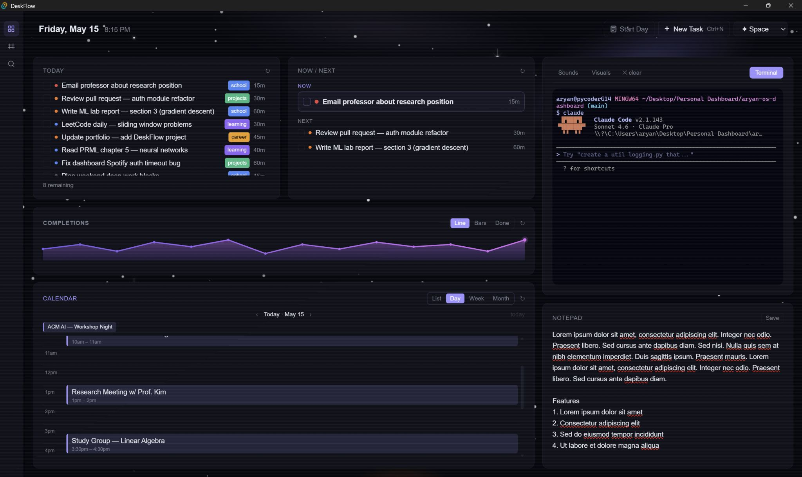
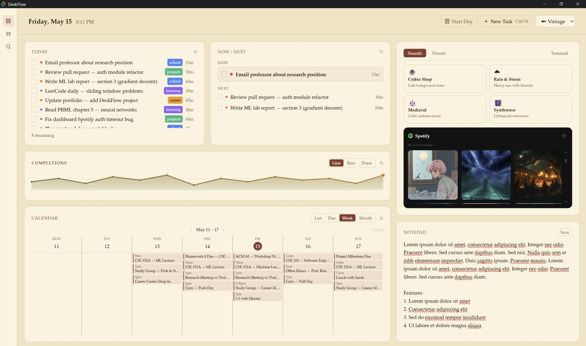
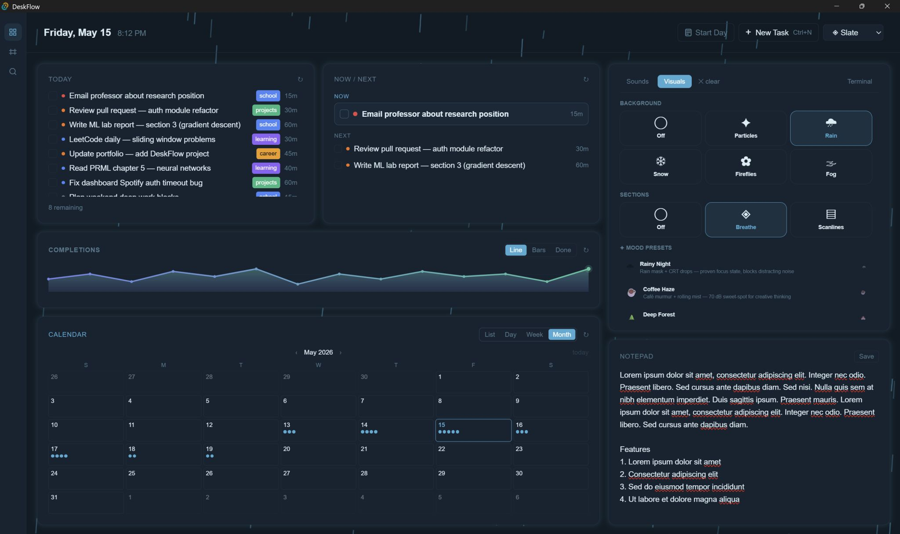

# DeskFlow

A personal desktop dashboard that pulls your daily workflow into one native window -- ClickUp tasks, Google Calendar, ambient sounds, an embedded terminal, and a Claude-powered focus picker that tells you what to work on next. Built with Tauri 2 + SvelteKit.

The brain is the **Now / Next** widget (the task paralysis killer): it reads your tasks, looks at today's calendar, and picks the single most important thing to do right now. Re-picks automatically as you complete tasks.

Designed to be personalized -- plug in your own ClickUp, calendar, and Claude account. Expect a few rough edges around setup. PRs welcome, and open to suggestions since this will be a ongoing project!

---

<p align="center">
  
  
</p>
<p align="center">
  
</p>

---

> ## ⚠ Claude billing change — June 15th 2026
>
> The `claude -p` subprocess this dashboard uses **stops being covered by Pro / Max subscriptions on June 15th 2026.** After that date you'll need an Anthropic API key (set `ANTHROPIC_API_KEY`). See [AI cost](#ai-cost) below for ways to reduce or disable it.

---

## Features

- **Now / Next** -- Claude picks 1 "Now" + up to 2 "Next" tasks from your daily list. Calendar-aware
- **Today Tasks** -- Live ClickUp daily list. Check off, edit, delete, open in ClickUp
- **Calendar** -- Day / Week / Month / List views via `gcalcli`. Logical day rolls over at 4 am
- **Start Day** -- AI-driven morning routine: refreshes stats, considers calendar, moves area-list tasks into Daily To-Do
- **TaskStats** -- 14-day completion chart + today's done list for motivation
- **Ambience** -- 4 ambient sound loops, Spotify playback, animated canvas FX, and an embedded PTY terminal
- **Notepad** -- Auto-saving scratchpad
- **Quick Capture (Ctrl+N)** -- Add a ClickUp task without leaving the dashboard
- **Action logging** -- Configurable destination: ClickUp doc, local Markdown file, or disabled
- **8 themes** -- light, dark, space, nord, forest, vintage, slate, cloudy. SVG-animated backgrounds for space / forest / cloudy

---

## Prerequisites

| Tool | Why | Setup |
|---|---|---|
| [Rust + Tauri](https://tauri.app/start/prerequisites/) | Desktop shell | Install Rust toolchain + WebView2 (Windows) |
| [Node.js 18+](https://nodejs.org/) | Frontend | `node -v` reports 18.x or newer |
| [Python 3.10+](https://www.python.org/) | Helper scripts | On PATH |
| [Claude Code](https://claude.ai/code) | Now/Next + Start Day | `claude` on PATH, logged in. **After June 15 2026:** also set `ANTHROPIC_API_KEY` |
| [gcalcli](https://github.com/insanum/gcalcli) | Calendar | `pip install gcalcli && gcalcli init` |
| [ClickUp](https://clickup.com) account | Tasks | Generate a personal API token (Settings → Apps) |
| [ffmpeg](https://ffmpeg.org/download.html) | Sound downloads | On PATH (`winget` / `brew` / distro package) |
| [Spotify Developer](https://developer.spotify.com/dashboard) app *(optional)* | Spotify in Ambience | Redirect URI: `http://127.0.0.1:8888/callback` |

---

## Setup

```bash
git clone https://github.com/pycoder49/deskflow.git
cd deskflow
npm install
pip install -r requirements.txt

gcalcli init                   # OAuth your Google account
claude                         # log in to Claude Code if you haven't

cp .env.example .env           # then fill in CLICKUP_TOKEN (Spotify keys optional)

python scripts/setup.py        # interactive wizard
npm run tauri dev
```

The wizard discovers your ClickUp workspace, asks which lists are your "daily truth" and "area" lists, picks a logging destination, finds your personal calendar via `gcalcli list`, and downloads the ambient sound clips. Re-run anytime your setup changes.

**Spotify**: after first launch, click **Connect Spotify** inside the Ambience widget to grant your account access.

---

## Configuration (`os-config.json`)

Written by the setup wizard. Gitignored. Hand-editable.

```json
{
  "clickup": {
    "workspace_id": "...",
    "daily_list_id": "...",
    "areas": [{ "list_id": "...", "label": "School", "slug": "school" }]
  },
  "calendar": { "personal_email": "you@example.com", "extra_calendars": [] },
  "commands": { "start_day_skill": "start-day" },
  "logging": {
    "mode": "local_file",
    "clickup_logs_folder_id": "",
    "local_file_path": "logs/actions.md"
  },
  "ambience": {
    "sounds": {
      "cafe":      "https://www.youtube.com/watch?v=...",
      "rain":      "https://www.youtube.com/watch?v=...",
      "medieval":  "https://www.youtube.com/watch?v=...",
      "cyberpunk": "https://www.youtube.com/watch?v=..."
    }
  }
}
```

- **`commands.start_day_skill`** -- Claude Code skill the Start Day button runs. Default `start-day` ships with the repo. Set to a custom skill name to override.
- **`logging.mode`** -- `clickup_doc`, `local_file`, or `none`. Completion counts for the chart record separately via Start Day and always work.

---

## AI cost

Two paths invoke Claude:

- **Now / Next** auto-fires on dashboard open and when an in-focus task changes. ~5-10 calls / day (number of tasks you complete), ~500 input tokens each.
- **Start Day** runs once per logical day when clicked. (state is stored, so subsequent clicks will not trigger the workflow).

If you wish to remove the AI aspect of planning, you can:

- Set `commands.start_day_skill` to a no-AI custom skill that just runs `python scripts/start_day.py` → Start Day costs zero tokens.
- Comment out the `NowNext` mount in `src/routes/+page.svelte` to disable the focus picker entirely.

Track spending at [console.anthropic.com](https://console.anthropic.com/).

---

## Project structure

```
src/
  routes/             SvelteKit pages
  lib/widgets/        Per-widget .svelte files
  lib/services/       TypeScript invoke() wrappers
  lib/stores/         Svelte stores (theme, refresh, ambience, config)
src-tauri/src/        Rust backend modules
scripts/              Setup wizard, action logger, sound downloader
.claude/skills/       Shipped Claude Code skills (e.g. start-day)
```

`INDEX.md` has a one-liner for every source file.

---

## Troubleshooting

**Calendar shows nothing.** Run `gcalcli agenda` in your terminal. If that works, make sure `calendar.personal_email` in `os-config.json` exactly matches an entry from `gcalcli list`.

**Now / Next won't load.** Run `claude -p "hi"`. If that fails, log into Claude Code (`claude` interactively first).

**Calendar crashes on emoji (Windows).** This is handled automatically — `PYTHONIOENCODING=utf-8` is set internally. If you still see encoding errors, make sure you're on the latest version of DeskFlow.

**Spotify auth fails.** Redirect URI must be exactly `http://127.0.0.1:8888/callback` — no trailing slash, no `localhost`.

**Start Day button does nothing.** Verify `commands.start_day_skill` in `os-config.json` and that `claude -p "/<that-skill>"` works when run from the project root.

**TaskStats chart frozen on demo data.** The chart populates from Start Day clicks (the Rust spawn runs `scripts/start_day.py --bootstrap` first, which records yesterday + backfills any missing days in the last 14 via direct ClickUp queries). Click Start Day each morning.

---

## Roadmap / Ideas

Things I want to build next — contributions welcome.

**Machine learning & behavioral modeling**
- **Task completion time prediction** — track how long tasks actually take vs. estimates per category; surface daily capacity warnings before you overcommit
- **Behavioral pattern learning** — learn when you complete certain types of tasks (time of day, day of week, energy state); let the AI picker factor this into its recommendations
- **Smart deferrals** — instead of bulk-moving every area task at Start Day, predict which ones you'll realistically touch based on historical completion patterns

**Workflow features**
- **Focus session tracking** — automatic Pomodoro-style sessions tied to the Now task; break suggestions based on actual session length; logged to stats
- **Weekly AI retrospective** — end-of-week summary of what got done, what kept getting deferred and why, and a suggested focus for next week
- **Natural language task capture** — parse "remind me to do X after my 3pm" and schedule it without opening ClickUp
- **Cross-device sync** — lightweight mobile companion app for capturing tasks on the go

**Integrations**
- GitHub (open PRs, review requests surfaced as tasks)
- Notion / Linear as alternative task backends
- More calendar providers (Outlook, CalDAV)

---

## License

[AGPL-3.0](LICENSE) — free to use, modify, and share. If you distribute a modified version or build a product on top of this, you must open-source your changes under the same license.
